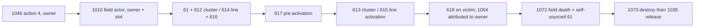

# Solo sandbox ability implementation and evidence

2026-09-07. Scope: `server/abilities.py`, `server/hitboxes.py` and their tests.
This is implementation progress toward the solo sandbox acceptance definition,
not a claim that every Vainglory hero kit or client presentation is complete.

## 2026-09-12 Skye C: native contract and two production corrections

Direct offline inspection joined the owned match-6 decoded cache, the Android
ARM64 library and the separately owned PC 4.13 Skye definition. No new client
capture was needed. `Tools/Teardown/inspect_skye_c_contract.py` reproduces the
record associations, source hashes and bounded native anchors. The results
support two corrections, not complete Skye fidelity:

- `SnapshotStream._step_heroes` now publishes C field activation before its
  first damage pulse. Previously the production regression emitted damage at
  record 46, followed by activation at 47. The corrected full-world scenario
  creates field 2000005 at record 155, activates it at 201, and emits the first
  owner-to-victim damage at 203. These are record indexes, not milliseconds.
- `SkyeKit.cast_ability` now selects a line at exactly two units from the marked
  target; cluster selection is strictly inside that threshold. The native
  comparison is `<`, whereas Halcyon previously used `<=`. Tests cover just
  inside, exactly on, and just outside the boundary on the simulation plane.

### Owned-record contract

The cache contains 114,825 decoded records and ten complete C field lifetimes:
nine cluster archetypes 384 and one line archetype 385, all owned by hero 1517.
Every observed lifetime has the following ordering; branch labels denote buff
kinds, while node labels 1010/1072/1073/1035 are opcodes:



The 332 victim buff-618 records each bracket exactly one tag-394 damage record
for the same owner and victim, before the next such marker or the field's death.
All have one active candidate field. No damage record names a field actor as
attacker. This is a reproducible identity/order association, **not a causal
field ID carried in 1054**. Tests preserve ambiguity for overlapping fields,
filter unrelated owners/victims/tags, and refuse to join across field death or
identity reuse. Ten episodes from one recording are not ten independent matches.

| Field or anchor | Measured value / interpretation |
|---|---|
| 1010, 126-byte body | Archetype at +0; class `0xF59CDB08` at +4; actor EID +8; owner +112; compact slot +116 |
| 1086 on actor | Warning 612/614; activation 613/615; 617 duration is approximately active duration +0.2; active durations 2 or 3 in these episodes |
| 1086 on victim | Kind 618, source 1517, f16 duration `0.0999755859375` |
| 1054 | Victim +0, owner +4, signed f32 delta +8, u16 tag +12; these 332 records have tag 394 and bytes +14/+15 = 1/0 |
| Native 1054 consumer | Ghidra `FUN_0092a0bc`, ELF `0x82a0bc`, preserves tag and both flag bytes through the event constructor; their downstream semantics remain open |
| CFF action vector | Action 4 points to definition 4464; its variable vector at 4952 points index 2 to named record 5116, `Cluster Missile Range = 2` |
| CFF named scalars | DELAY 1.3 at 5192; Duration `(2,+1)` at 5252; stun .5 at 5316; slow `(.55,+.05)` at 5384 |
| Native selection | ELF `0xce3378..0xce33c0` looks up action 4 / variable 2, compares squared distance to squared variable, then `FCMP; CSET MI` returns strict less-than |
| Native actor branch | Ghidra `FUN_00de3520` selects `Skye_MissileVolley` for true, `Skye_LineMissileVolley` for false |

### What native geometry does and does not establish

The decompiler's function names are rebased **+0x100000** relative to ELF
virtual addresses. The inspector maps ELF load segments and requires the
pinned library hash before decoding; the original unrebased disassembly in
the evidence directory is superseded by `native-anchors-rebased.asm.txt`.

Ghidra `FUN_00e3fdf0` / ELF `0xd3fdf0` constructs a configuration argument
containing **2.5**, separately from the CFF selection threshold 2. But following
the allocated object's actual vtable at ELF `0x26c1130`, slot `0x30`, reaches
`0x8a43cc`: it only returns the subobject at `this + 0x10`, ignoring the argument.
That constant therefore does **not** prove an operational 2.5 damage radius
in this client. The inspector records this negative evidence explicitly.

The line endpoint callback at ELF `0xd3ff78` computes center ± facing × **5**,
a ten-unit segment. The line query path continues through Ghidra
`FUN_00d9d354` → `FUN_00d4e838` and the segment-distance predicate
`FUN_00d4e6ac`, with eligibility/extent flags still requiring interpretation.
Halcyon's cluster radius 2, line length 12 and width policy therefore remain
calibration policies. No footprint change follows from these incomplete paths.
Client code is useful for precise branches and message consumers without being
a complete executable server oracle.

### Reproduction and remaining gaps

Evidence directory (outside the repo):
`%LOCALAPPDATA%/halcyon-evidence/halcyon-skye-c-contract-20260912-snyo5lk8`.
`contract-final.json` includes all ten lifetimes, 332 associations, decoded
tag-394 records, named constants and verified native anchors. Older exploratory
reports are retained; the final report supersedes their scalar interpretation.

| Owned input | SHA-256 |
|---|---|
| `%TEMP%/vg_max/match6.halcyon_spawn_audit.pkl` | `f1a62ba1b80751b704dfcc6e58f9a733ba7c205a465d8980055f40c6d409b1ad` |
| `D:/Downloads/vg/lib/arm64-v8a/libGameKindred.so` | `cd1b8831f82c469274613fc30f1f1f6e78c788102cdad7db5db2c04b96580a47` |
| PC Skye CFF `Data/0C/0CB20BA22E7D1BBCC89CBCF4895B8E6F` | `f61d03159bcb2d41d69172376d67f004769b7a26c39a7ea3bd77e4e6a8369237` |

```powershell
python -B Tools/Teardown/inspect_skye_c_contract.py `
  --frame-cache "$env:TEMP/vg_max/match6.halcyon_spawn_audit.pkl" `
  --library 'D:/Downloads/vg/lib/arm64-v8a/libGameKindred.so' `
  --definition 'D:/Downloads/vg/pc/Vainglory 4.13/Vainglory/Data/0C/0CB20BA22E7D1BBCC89CBCF4895B8E6F'
# Use the external corpus environment variables from solo-sandbox-scenarios.md.
python -B -m unittest server.test.test_skye_session server.test.test_skye_kit server.test.test_skye_contract_inspector -q
python -B Tools/run_scenarios.py --mode headless --scenario skye-c
```

Verification: **37 tests pass**; the production `skye-c` scenario passes with
byte-identical events, initial/final state and checkpoints across seeds 11 and
7919 (`production-skye-c-final/summary.json`). Both new regressions were first
observed failing before their fixes. `production-order-check.json` records the
activation-before-damage check on the full-world event stream. The inspector
requires Capstone for bounded ARM64 decoding. All source payloads stay external.

Still open: native damage tag/flag consumer semantics (Halcyon C currently emits
generic tag 5 rather than observed tag 394), exact hit eligibility/footprints,
active-field reconstruction on reconnect, vertical/f32 selection parity,
new rendered-client acceptance, and independently measured gameplay fidelity.
The headless runner still reports reference `UNAVAILABLE`; this cache supplies
structural evidence, not a complete rank/input/time-normalized reference fixture.

## Implemented contracts

- Finite line sweeps with first-contact or piercing behavior; ties resolve by
  entity ID. Target disks contribute their radius to collision checks.
- Circular sectors for cones, circles for ground areas, and delayed effects
  which evaluate entity positions on the impact tick.
- Vector dashes and directional dash sweeps use `HeroMovement.dash_to`, including
  terrain clipping. Contact damage cannot pass through an obstructing wall.
- Cast validation precedes energy/cooldown mutation. Dead, friendly, missing,
  out-of-range or non-finite targets cannot spend resources. A rejected cast
  cannot activate an item passive.
- Channeled effects check death, input-order changes and the status-manager
  interruption serial. STUN, SILENCE and KNOCKBACK interrupt even if their
  status expires between ticks; CC immunity prevents that interruption.
- Ability cooldown acceleration is `base / (1 + bonus)`. Named source curves
  replace the former generic `+30 damage / -0.5 second` upgrade behavior.
- Runtime selection factories start with rank zero. The economy manager spends
  points through `HeroKit.upgrade_ability`; named standalone kit factories start
  at rank one for isolated simulation. Ultimate gates are 6/9/12; intermediate
  basic gates `(1,2,4,6,8)` remain a rule-layer prior requiring client verification.
- `cast_ability(..., damage_callback, cast_callback)`, `step(...)` and
  `on_basic_attack(...)` connect effects to match combat and item passives.
  Adagio's ally attack buff is consumed by the receiving hero's kit.

## Corrected premises

The manifest establishes Catherine=242, Ringo=243, Adagio=244, Koshka=245,
Taka/Sayoc=256, Lance=275, Celeste=285, Gwen=395 and Amael=925. The old
`924 -> Ringo` and `245 -> Catherine` aliases were wrong; 924 is Viola.
Unknown or unimplemented heroes receive no substitute kit.

Catherine's Merciless Pursuit grants running speed and empowers a basic attack;
it is not an instantaneous targeted dash. Her Stormguard is not a 300-HP
barrier, so that false substitute was removed. Hellfire Brew channels before
damage. Twirling Silver uses expiring modifiers and does not permanently alter
the hero's speed or basic attack cooldown.

The older `hero_abilities_clean.tsv` reader assigned several numeric rows to
the preceding text label: Ringo's apparent `Cooldown=40` is its energy cost.
The name-pointer records give A cooldown 9, energy 40 and range 8. Tests now
assert those named records rather than the scaffold's fabricated constants.

## Reproduction

The read-only inspector prints only selected numeric records, offsets and names.
Its first-revision cipher entry and PTCH route are the existing mechanics-matrix
section 18 method. Decrypted payloads stay in memory and are not saved.

```powershell
python Tools/Teardown/inspect_ability_constants.py 'D:/Downloads/vg/pc/Vainglory 4.13/Vainglory/Data/4C/4CD5EDF7916C07C38EAD38BE1472FBFD' --field 'ENERGY COST' --field Chargetime
python Tools/Teardown/inspect_ability_constants.py 'D:/Downloads/vg/pc/Vainglory 4.13/Vainglory/Data/E2/E2E212FBCFCE9E9E2A7D85CA951B5389'
python -m unittest server.test.test_abilities server.test.test_hitboxes -q
```

Amael's named cost records are at pointer offsets 1420 `(40,5)`, 2736 `(50,10)`
and 3924 `(80,15)`; charge time at 1544 is 1.4 seconds. Ringo's A records are
1468 cooldown `(9,-0.5)`, 1532 energy `(40,5)`, 1596 range `8`, with slow
strength at 1656 and duration at 1724. Damage-spec records are a different
layout from scalar records; a positional extra coefficient must not be assigned
an overdrive meaning without corroboration.

Primary public descriptions corroborate behavior, while the shipped 4.13
numbers take precedence over older web balance values:

- [Amael's release description](https://www.vainglorygame.com/news/update-413-amael-the-mercenary-menace/): charge/recast punch, backward/forward sweep and conditional ultimate splash.
- [Gwen](https://www.vainglorygame.com/heroes/gwen/): cone, cleanse and a shot that stops at the first enemy hero.
- [Celeste](https://www.vainglorygame.com/heroes/celeste/): lingering stars, supernova and delayed collapse.
- [Taka](https://www.vainglorygame.com/heroes/taka/): targeted flip behind an enemy.
- [Adagio](https://www.vainglorygame.com/heroes/adagio/): ally heal, attack buff and channel with conditional stun.
- [Ringo](https://www.vainglorygame.com/heroes/ringo/): targeted slow, attack steroid and channeled fireball.

## Remaining acceptance gaps

`HeroKit.coverage_notes` records the current per-kit gaps. Material examples:

- Damage-spec overdrive coefficients, some geometric widths, intermediate
  upgrade gates and several animation/travel timings need runtime confirmation.
- Amael's staged dashes clip against terrain but snap between stage boundaries.
  Bull-Dozer splash radius 3.5 and knockup duration 0.5 are provisional;
  Pump It Up is not implemented.
- Ringo's Hellfire and Catherine's Stormguard now have simulation lifecycles
  (see the follow-up below), with timing/damage calibration still open. Celeste's
  Solar Storm; Koshka's ultimate; Taka's B/ultimate; Lance's stamina and B/ultimate
  remain incomplete. Heroic perks are not complete.
- Adagio's Arcane Fire coefficient and burst-heal health-ratio ownership need
  runtime confirmation; Arcane Renewal is not complete.
- Native cast starts use 1045 target/action or 1046 point/action fields; the
  action is the native action-list ordinal, not necessarily the UI slot.
  The source/corpus join below supersedes the previous slot reading. 1078 is a learned
  skill echo, so it is no longer emitted as a cast acknowledgement. No adjacent
  fabricated timer hashes are emitted. The later native-symbol join below
  supplies measured 1162 identities; otherwise tags remain `None`
  until measured. Synthetic impact-position frames have been removed.
- Passing engine tests proves the simulation contracts above; the live mobile
  mana HUD, timing, collision presentation and all acceptance actions still
  require end-to-end validation against the unchanged client.

The targeted ability/geometry suite passed 69 tests after this implementation.

## Native cooldown identity follow-up, 2026-09-07

The native `Ability__<Hero>__A/B/C` symbols were read directly from the
operator's external `$env:TEMP/vg_max/inst_dump/*.inst.bin` metadata for
Ringo, Catherine, Gwen, Celeste, Lance, Adagio, Koshka, and Amael. The item
wire pass independently joined these FNV-1a identities to captured 1162
messages. Ringo A is `0xc8d51d33`; Amael A is `0x60482b06`.

Registered abilities for those eight named kits now use the corresponding
native identities. Casts emit the measured 22-byte layout through
`cooldown_wire.build_ability_timer`: entity id, native tag, remaining cooldown,
full duration, and six state bytes. Ultimate state is distinguished from A/B.
This corrects the old premise that 1162 contained only one timer float.
The subsequent native action-list pass joins Sayoc's internal symbols to
`Ability__Taka__A/B/C`, so Taka now uses those exact timer identities too.
Charge-specific presentation, including Amael's reactivation button, still
requires the client check; a standard cooldown event does not prove that flow.

## Production minion regression, 2026-09-07

A live Adagio A cast near a lane minion exposed an invalid assumption:
`wave.Minion` uses `__slots__`, so attaching an `arcane_fire` field raised
`AttributeError` and stopped the world loop. Arcane Fire expiry now belongs
to the caster's kit, keyed by target entity id. Verse and allied Agent of
Wrath read that metadata; expiry cleanup preserves shared buff references.
The regression sends the actual self-targeted 1041 A packet through
`SnapshotStream` with a production minion and verifies that damage and
subsequent simulation ticks continue. A second regression checks allied
Wrath's burn bonus and its expiry against that slotted class.

## Native action contracts and two kit lifecycles, 2026-09-07

`Tools/Teardown/inspect_ability_actions.py` reads the first-revision hero header's
`PTCH[100]` pointer vector and each definition's `PTCH[definition+4]` name.
`server/ability_wire.py` retains only numeric ordinals for 65 hero definitions.
Empowered attacks, cancel actions and alternate casts occupy entries alongside
A/B/C. For example, Catherine's entries are empowered A attack, A, B, C,
and B reflection, so her A/B/C actions are **1/2/3**, whereas Ringo's are 0/1/2.
Gwen's perk attack similarly makes A/B/C 1/2/3. Skye's C is action 4 and
Yates's C is action 3. Unjoined heroes/forms return `None`.

The wire contracts are:

| Opcode | Layout | Meaning |
| --- | --- | --- |
| 1045 | source u32, target u32, action u8, five zero bytes | Targeted/self action start; target `ffffffff` is allowed |
| 1046 | source u32, x/z/y f32, action u8, five zero bytes | Ground-aimed action start; the final byte is not an impact kind |

Only one native action start is emitted for a normal accepted cast. Ground
area, cone, line and directional dash use 1046; targeted vector dash and
target/self abilities use 1045. Spell impact and self-buff application no
longer manufacture 1046 packets. Native channel-interrupt and extra projectile
presentation contracts remain unmeasured; an animation is not considered
accepted merely because the simulation test passed.

Own external golden anchors (zero-based chunk rows):

- `$env:TEMP/vg_phaseB/vgr_live/ea4c7fda-4b61-481d-abb7-1c757d24ae58-1574e27a-e851-492b-8d91-94fc4bd66985.4.vgr`
  row 506: Catherine 1516 action 1, followed by native self buffs 371/372.
  Row 532 action 0 starts the empowered attack; target stun kind 22 follows.
- Same match `.13.vgr` row 1119: action 2, followed by Stormguard kind 373
  lasting four seconds. Burn starts immediately at 136.332214 seconds and
  repeats at approximately half-second intervals.
- Same match `.18.vgr` row 754: action 5, followed by Recall kinds 25/26.
  Recall follows the hero-specific vector. Adagio/Phinn action 3 also has
  independent captures; other heroes apply this shared rule to their native
  vector length (Ringo/Amael/Gwen 4, Catherine 5).
- `$env:TEMP/vg_max/match6.halcyon_spawn_audit.pkl` indices 47634, 49026 and
  53573: native 1046 Yates C=3, Skye C=4 and Reim C=2, rebuilt byte-for-byte.

Ringo now channels, launches a homing projectile, resolves its impact against
the target's current position, splashes within 3.5 units, and applies a
four-second burn anchored to the target with one pulse per second and radius
3.0. The initial explosion ignores shield; burn uses ordinary crystal damage.
The internal shield-piercing crystal damage type preserves crystal-hit item
passives, percentage reduction and barriers. A production regression verifies
that Hellfire pierces a 1000-shield target and still applies Spellfire's wound.
Damage records are direct impact `250 + 150/rank + 0.75 CP` and burn
`55 + 35/rank + 0.4 CP`; these are native first-revision DamageSpec values,
with `/rank` meaning per rank after the first. Initial scalar pointers are
3468 impact radius, 3540 tick rate, 3608 burn duration and 3676 burn radius.
Source: `E2/E2E212FBCFCE9E9E2A7D85CA951B5389` beneath the external PC Data root.
The [official Ringo description](https://www.vainglorygame.com/heroes/ringo/)
corroborates homing, shield penetration and the two areas; its old seven-second
burn value is superseded by native four seconds. **Channel 1.5 seconds and
travel speed 12 units/second remain explicit policies requiring measurement**;
the latter can be passed to `create_ringo_kit(projectile_speed=...)`.

Catherine B now spends native energy `40 + 10/rank`, uses cooldown
`13 - 0.5/rank`, and starts the native four-second bubble 373. A production
pre-resistance hook caps one incoming raw hit at 7.5% of her base maximum HP
including level growth and excluding equipment. The excess is queued through
ordinary world damage resolution with native reflection amplification
0/5/10/15/25%; each reflection shortens the bubble by 0.2 seconds. Its native
instance remains stable, reconnect snapshots use the shortened duration,
and 1093 cancels it when the shorter deadline arrives. Reflection action 4 is
measured in the same Catherine match `.16.vgr` rows 1756 and 1881, immediately
before the capped incoming damage records at 1764 and 1889.

Stormguard's radius 3.2, reflect range 10, threshold 0.075, multiplier curve,
and duration loss are named scalar records at 3264/3404/3328/3476/3552 in
`98/98B6FF5C43A2EB13831F4EAD75CD0886`. The burn DamageSpec is 45 + 20/rank +
0.5 CP. **Its conversion to damage per pulse remains open**: the implementation
currently treats that value as DPS and deals half every half-second; the
recorded rank-one bot deals 29.249998 per minion per pulse, which needs the
bot/mode and stat modifiers separated before claiming numerical agreement.
Reflection currently chooses the nearest three enemies within range 10;
that target cap and reflection projectile timing are also explicit policies.
The [official Catherine description](https://www.vainglorygame.com/heroes/catherine/)
supports deflection rather than a barrier. The native duration/multiplier
values supersede older public balance values.

`test_ability_wire.py` checks all retained ordinals against the own external
CFF records and the wire goldens above. `test_spell_lifecycles.py` checks
homing, moving splash/burn areas, source/target death, early bubble expiry,
rank scaling and all four shape presentations. `test_stormguard_session.py`
uses actual client self-B input and the production `SnapshotStream` damage
path: cap before armor, one HP update, one reflected kill/bounty, and retention
of the reflection action when a barrier fully absorbs the incoming HP damage.

The final focused command passed 96 tests, including the separate measured
Recall contract in `solo-sandbox-recall.md`:

```powershell
python -m unittest server.test.test_abilities server.test.test_hitboxes server.test.test_ability_wire server.test.test_spell_lifecycles server.test.test_adagio_minion server.test.test_stormguard_session server.test.test_hellfire_session server.test.test_recall_wire -q
```

## Skill-rank action correction, 2026-09-07

Native `1082` carries `[u32 hero][u32 native action ordinal][6 zero bytes]`.
Its second field is not the three-button UI slot. The `1078` request and
owner-only echo remain `[u8 UI slot][5 zero bytes]`. This distinction caused
the local Catherine ultimate to remain dark after a successful authoritative
upgrade: the server acknowledged action 2, which identifies her B, while
sending a ready timer for C. A timer does not replace the action's learned rank.

| Catherine ability | Input/echo UI slot | Native `1082` action | Native timer tag |
|---|---:|---:|---|
| Merciless Pursuit (A) | 0 | 1 | `72c2bc67` |
| Stormguard (B) | 1 | 2 | `73c2bdfa` |
| Blast Tremor (C) | 2 | 3 | `74c2bf8d` |

The native Catherine replay above supplies the distinguishing proof. In
`.1.vgr`, row 419 at 12.985494 s sends `1082 [1516,1]`. The `.2.vgr` snapshot
at 20.006056 s has A learned with cooldown 16, B/C still unlearned, and zero
remaining points. `.11.vgr`, row 1261 at 117.343788 s sends `[1516,2]`; the
`.12.vgr` snapshot at 120.006363 s first shows B learned with cooldown 13,
while C remains unlearned. Repeated A upgrades use action 1 and reduce its
cooldown 16→15→14; repeated B upgrades use action 2 and reduce 13→12.5.
These bot transitions do not require guessing which button a person clicked.

Input is independently measured on the owned local Catherine client: the
operator's C-plus click at x553/y441 appears in
`$TEMP/halcyon_stack/wire-1788796968592819300.jsonl` as c2s `1078 02 00 00 00 00 00`
at epoch 1788798298.989961. The later QA trace
`wire-1788799203725554700.jsonl` sent C/A/B `1082` ordinals 2/0/1, which explains
the wrong action ranks despite correct native timer tags. Existing Amael and
Phinn request/ack captures have identical UI and action indices and could not
distinguish these fields by themselves.

The learned-skill helper and reconnect notifications now use each ability's
native action index. `test_ability_rank_wire.py` checks the native Catherine
snapshot transitions, all 21 implemented abilities across nine named kits
against their CFF action symbols and timer hashes, the production human
upgrade route, the local QA learn command, and reconnect rank notifications.
The session cases require UI C input 2 to produce owner echo 2, broadcast
action 3, and C's learned 90-second timer. Visible client acceptance remains
a separate check from these packet and authoritative-state regressions.

Native action indices also apply to **cast input**, while the skill-point
request remains a UI slot. In the same owned local trace, clicking Catherine's
first ability at x407/y489 emitted c2s `1041 ff ff ff ff 01 00` at epoch
1788800004.0111146 (23:53:24 local). The former UI-slot interpretation cast B
and displayed the Stormguard bubble. The Recall button emitted
`1041 ff ff ff ff 05 00` at epoch 1788800117.7488608 (23:55:17 local), matching
her independently recovered common-action index 5. Universal Recall index 3
was an invalid generalization from heroes whose native action vectors contain
exactly three entries.

`ability_wire.hero_slot_for_action(hero_id_or_name, action)` now maps native
cast actions to authoritative A/B/C slots. `1041`, `1042` and the compatibility
`1102` route use this conversion; unknown actions never fall back to the same
numeric UI slot. Recall uses the hero's separate native common-action index.
The additional regressions replay Catherine's observed action1 request,
exercise ground action3 as C, reject empowered/reflection indices as UI skills,
and verify Recall5. The `1102` case checks consistent compatibility routing;
it is not presented as a measured Catherine `1102` request. Ringo A remains
action0 with its native timer, and Ringo Recall is action4.

```powershell
python -B -m unittest server.test.test_ability_rank_wire -q
```

## Owned Gwen cone and empty-energy acceptance, 2026-09-08

This bounded live check uses
`$TEMP/halcyon_stack/wire-1788804074149933400.jsonl`, connection
1788669376464, Gwen hero 395/source EID 1500. JSONL lines are one-based and
times below are logged Unix seconds. The setup is independently recorded in
`$TEMP/halcyon_qa_gwen3_20260908/journal.jsonl` lines 47–54: Gwen `(0,35)` at
sim 810.95, Baptiste/1517 `(4,35)` at 811.35, Krul/1518 `(4,37)` at 811.75,
and Viola/1519 `(-4,35)` at 812.35. Each teleport completed successfully.

The initial A and C requests are useful miss controls, not successful line
hits. A's c2s 1042 action 1 at line 41344/time 1788805103.8980193 aims at
`(4.6402611732,32.2528610229)`, consumes 50 EP at line 41345 and receives
native action 1 at line 41346. C's action 3 at line 41479/time
1788805105.7499158 aims at the same point, consumes 100 EP at line 41480 and
receives native action 3 at line 41481. Neither window contains a Gwen-sourced
damage event. The recorded aim misses these prepared targets under the
current cone/line geometry; this does not establish native hitbox dimensions.

The corrected A **passes the prepared cone test**:

| Line | Logged time | Observation |
|---:|---:|---|
| 43721 | 1788805141.5239944 | c2s 1042 action 1, aim `(4.6990695000,34.9242401123)` |
| 43722 | 1788805141.5249794 | source 1500 energy delta `-50` |
| 43723 | 1788805141.5254693 | s2c 1046 acknowledges native action 1 |
| 43753 | 1788805141.8148296 | victim 1517/source 1500 damage `-116.8911743164` |
| 43754 | 1788805141.8152168 | victim 1518/source 1500 damage `-120.4333343506` |

Both hits arrive about 291 ms after input. No Gwen hit addresses the rear
target 1519 in this effect window, and the inspected external
`$TEMP/gwen3-cone-corrected.png` shows the rounded 117/120 damage numbers and
Viola behind Gwen without a corresponding hit. There is no ordinary 1045 or
extra Gwen damage event between this cast and the subsequent resource reset.
Thus these two records are the cone's hits, not Aftershock procs. Their wire
fields are class 5/type 4, used here for nonbasic damage; type 4 alone does not
identify crystal damage or an item proc.

Stat growth and inventory explain the amounts. Gwen is level 10 at the
corrected cast: her ninth 1076 increment is line 41620/time
1788805107.754083, matching the displayed level. Inventory instance 2004 is
Aftershock/492, added at line 20794, with 30 CP, 1 EP/s regeneration and 15%
cooldown reduction. With the current recovered stats, rank-one A's raw damage
is `60 + 2*30 + 0.65*(68 + 9*5.9) = 198.715`; Baptiste's level-nine armor 70
and Krul's level-eight armor 65 give 116.891176 and 120.433333 respectively,
matching the emitted floats. A's timer is 6.0869565 seconds (`7/1.15`), while
C's earlier timer is 78.2608719 seconds (`90/1.15`). Aftershock's next-basic
proc is a separate effect and was not consumed by these cone hits.

The **ready B button passes the empty-energy client gate**. QA command
`3e9238c21de742e890efd5c95075f33e` completes at tick 17551/sim 877.55 with
energy 0 (journal lines 55–56 and its matching external acknowledgement).
Wire line 43843/time 1788805143.1656325 removes 312.2799987793 EP. This is a
fixture reset, not an ability cost. The corrected A started from the level-ten
maximum 355 EP; its 50-EP spend plus 32 ordinary regeneration updates of
0.2275 EP gives `355 - 50 + 32*0.2275 = 312.28` before that reset. Earlier
level-nine updates were 0.22 EP/tick; the increase follows Gwen's 0.15 EP/s
per-level growth plus Aftershock's existing 1 EP/s, not a cast refund.

The inspected `$TEMP/gwen3-no-energy.png` shows the empty bar and blocked
ability icons. No c2s 1041/1042/1102 request follows the corrected A anywhere
in the remaining trace, and no new ability acknowledgement or spend follows
the empty-energy clicks. This demonstrates client-side gating, not a server
rejection of a received cast. C was additionally on cooldown (about 41 seconds
remaining), so its blocked icon does not isolate energy as the cause. A
successful native line hit remains pending; this check does not close that
acceptance gate or the remaining cone-angle fidelity question.

## Owned Celeste delayed ground AoE and stun, 2026-09-08

The trace is `$TEMP/halcyon_stack/wire-1788805712141535000.jsonl`, connection
1410964560464, Celeste hero 285/source 1500. Preparation is explicit in
`$TEMP/halcyon_qa_celeste_20260908/journal.jsonl`: A rank one at tick 1217/sim
60.85; B rank one at tick 1223/sim 61.15. The B preparation grants 6.85 XP to
reach level two, with zero extra skill points. These are prepared fixture
ranks; the measured casts below are actual native client requests. Successful
teleports at sim 61.35–62.1 place Celeste at `(0,35)`, Baptiste/1517 at `(4,35)`,
Krul/1518 at `(4,37)` and Viola/1519 at `(-4,35)`.

**Delayed ground damage passes this prepared two-target test.** All casts
below aim near `(4.5423222,35.2574997)`. Each produces exactly two matching
source-1500 negative 1054 records in its effect window, to 1517 and 1518;
the rear target 1519 receives neither damage nor a stun from these casts.
Line numbers are one-based JSONL; times are logged Unix seconds.

| Cast | Input line / time | Energy spend | Damage lines / first time | Per-target damage | Input-to-first-hit |
|---|---|---|---|---:|---:|
| A, native action 0 | 5846 / 1788805929.2408416 | line 5847: 30 EP | 5903/5904 / 1788805929.8472722 | 48.5291633606 | 606.431 ms |
| B, native action 1 | 6049 / 1788805931.7888732 | line 6050: 100 EP | 6100/6101 / 1788805932.6016297 | 80.8819351196 | 812.757 ms |
| A, repeated with clear view | 8921 / 1788805987.7067833 | line 8922: 30 EP | 8955/8956 / 1788805988.307624 | 47.1423873901 | 600.841 ms |
| A, later capture pair | 10540 / 1788806026.8994665 | line 10541: 30 EP | 10575/10576 / 1788806027.5006583 | 47.1423873901 | 601.192 ms |

The accepted casts receive native 1046 action 0/1 responses and timers:
A tag `5bfabeaf` lasts 2.8 seconds; B tag `5cfac042` lasts 14 seconds. The
observed delays are consistent with the scheduled 0.6/0.8-second effects;
wall-clock logging and input queues do not identify the exact internal tick.

**B's native stun presentation also passes.** After its two damage records,
line 6102/time 1788805932.6030056 adds buff kind 22 to 1517 from 1500,
duration 1.0 second, instance 2000916. Line 6103/time 1788805932.6034868
adds the same kind/duration to 1518 as distinct instance 2000917. No early
1093 cancellation of those identities occurs in the inspected trace. The
external `celeste-collapse-stun.png` visibly shows both STUNNED labels and
rounded 81 damage numbers, although an open client panel overlaps part of
the scene.

The separately inspected `$TEMP/celeste-aoe-clear.png` clearly shows the two
rounded 47 hits without that panel. `$TEMP/celeste-aoe-windup.png` still shows
the targeting prompt and `$TEMP/celeste-aoe-damage.png` shows the later
cooldown and shorter target health bars, without visible damage numbers.
That pair supports the visual before/after context; the numeric delay is
established by the input/damage timestamps rather than inferred screenshot
capture times. No screenshot alone proves exact animation-frame timing.

The damage change is explained by target growth: 1076 records and the
displayed levels give level two for the first A/B and level three for the
later A casts. Both targets' shield grows from 23.637 to 27.274, so rank-one
A's raw 60 changes from 48.529163 to 47.142387 after mitigation; B's raw 100
gives 80.881935 at level two. Celeste has only initial inventory IDs 457/526,
so there is no item damage proc or CP purchase to fold into these hits.
Ordinary EP regeneration likewise grows from 0.187 to 0.1975 per 0.05-second
tick (`3.53 + 0.21*(level-1)` EP/s); these positive deltas are separate from
the immediate 30/100-EP costs. Native AoE-radius fidelity beyond this setup,
line hits, vector dashes and channel interruption remain separate checks.

## Celeste basic-attack damage audit, 2026-09-08

The no-item Celeste session exposed a separate attack blocker: her native
weapon base and growth are both zero, while the simulation had no Julia's
Light damage component. The general damage callback rejected the resulting
zero hit before item or kit basic-attack callbacks could run. Adding a perk
only inside that later callback would therefore leave the blocker in place.

The first revision of the operator-owned Celeste file
`D:/Downloads/vg/pc/Vainglory 4.13/Vainglory/Data/DD/DD70F13AABF2B1B43E95B27FE45A2676`
contains zero f32 weapon base/growth at INST offsets 156/160 and attack range
5.3000001907 at 196. PTCH slot 108 leads to the action group at 4104;
its ordinary list names DefaultAttack/AltAttack (native actions 7/8), and
its critical list names CritAttack (9). These names do not expose the perk
damage coefficients. Neither the inspected CelesteStar entity nor the
Buff_CelesteStar_HeroicPerk registry record supplies those coefficients.
Decrypted metadata was inspected in memory; no payload was added to this repo.

The current native help panel resolves the missing numbers. In the unchanged
Celeste client, opening the question-mark help button displays Julia's Light
below the three ability descriptions. The captured and independently viewed
`$TEMP/celeste-perk-help.png` gives base damage 75-to-125 across levels 1-to-12,
75% crystal-power scaling and 100% weapon-power scaling. It describes the
entire attack as crystal damage, plus a 1.5-second target reveal. The external
screenshot stays outside the repo.

`HeroKit.basic_attack_damage_profile()` therefore returns one crystal basic
hit with raw damage `75 + (level-1)*50/11 + 0.75*CP + WP`. The native tooltip
establishes the endpoints and ratios; linear intermediate-level interpolation
remains an explicit simulation policy requiring a numeric runtime measurement.
The release-time callback snapshots this damage and type into the projectile.
Its impact uses ordinary `basic=True` combat so item and kit callbacks run
once; no extra zero-WP hit or second Julia's Light hit is emitted. Native hero
weapon-base/growth values stay zero, and purchased WP enters the crystal hit.
Other heroes retain their existing weapon damage profile.

The historical [publisher's Celeste description](https://www.vainglorygame.com/heroes/celeste/)
has an earlier 65-to-115 crystal component, weapon damage 10, range 5 and
50% CP ratio. The [official 1.16 patch](https://en.vainglorygame.com/vainglorylive/spring-update-1-16-notes-halcyon-days/)
raises the ratio to 75%. Those older public numbers are superseded here by
the current native tooltip, not combined with it to fabricate extra damage.

`python -m unittest server.test.test_celeste_basic server.test.test_abilities -q`
passes 59 tests, including no-item damage with native WP zero, both tooltip
level endpoints, current CP/WP contributions in a single crystal hit, and the
unchanged fallback for other kits. This establishes the kit profile, while
projectile integration, item callbacks and live client damage are separate
verification steps. Julia's Light's persistent target reveal remains open.

## Gwen C line acceptance, 2026-09-08

**The bounded line-hit scenario is met.** A real Aces High input hits and
stuns the first hero on the line, while a hero directly behind it and another
off the line receive no Gwen damage or stun. Source: external
`$TEMP/halcyon_stack/wire-1788810206949588100.jsonl`, connection
`2598410757328`, Gwen EID `1500`. The actual screenshot
`$TEMP/halcyon_stack/gwen4-line-corrected.png` was independently viewed and
shows the rounded **288** damage and **STUNNED** label.

The QA journal at `$TEMP/halcyon_qa_gwen4_20260908/journal.jsonl` records a
legal rank-one C learn at tick 873/time 43.65, raising Gwen to level six
with 456.35 fixture XP and no invented ability points. The following accepted
teleports place Gwen at `(0,35)`, Baptiste/1517 at `(4,35)`, Krul/1518 at
`(8,35)` and Viola/1519 at `(4,37)`, at times 43.9/44.15/44.35/44.5.
There is no intervening QA mutation before the casts; subsequent minion
isolation starts at time 419.75, after this line test.

| Line | Logged time | Observed native event |
|---:|---:|---|
| 11338 | 1788810472.0529633 | c2s 1042, native action 3, aim `(9.1742315292,34.9151000977)` |
| 11339 | 1788810472.0537055 | s2c 1053, Gwen energy −100 |
| 11340 | 1788810472.0554397 | s2c 1046, Gwen/action 3, identical aim |
| 11341 | 1788810472.0560668 | s2c 1162, native tag `0x37422281`, remaining/duration 90 seconds |
| 11365 | 1788810472.605889 | s2c 1054, victim 1517/source 1500, HP delta −288.1428527832, class 5/type 4 |
| 11366 | 1788810472.6069984 | s2c 1086, victim 1517/source 1500, STUN22, instance 2001161, duration 0.89990234375 |

The duration is the wire half-float encoding of the rank-one 0.9-second stun.
No additional source-1500 damage, ordinary attack, or stun on 1518/1519
appears in the two-second window following the cast. The simulation's finite
line check with length 14 and half-width 0.5 orders the prepared targets as
`[1517,1518]`; first-hero stopping retains only 1517. Viola is outside it.
The last four hero-position records are the earlier fixture teleports, not
newly sampled coordinates at impact; the trace contains no intervening hero
position change before this cast.

Native level-up records and the screenshot establish Gwen level seven and
Baptiste level three. Inventory records contain only initial items 457/526,
so WP is `68 + 6*5.9 = 103.4`, CP is zero and Baptiste armor is 40.
The expected weapon hit `(300 + 103.4)/1.4 = 288.142857` matches the emitted
f32 amount. The non-basic type-4 presentation is not evidence of crystal
damage, and this cast does not produce an Aftershock proc.

The earlier real C at line 4497/time 1788810340.6033823 aimed at
`(9.1022996902,33.7443962097)`. It spent 100 energy, echoed action 3 and
started the same 90-second cooldown, but the finite line misses all three
prepared heroes and no Gwen damage/stun appears in its two-second window.
It remains a negative aim control. The corrected cast is 131.450 logged
seconds later, after the original cooldown.

This establishes the accepted line contact and first-hero discrimination.
The current implementation resolves the line after its configured 0.6-second
delay; it does not yet simulate Aces High travelling along that line. The
552.926-ms input-to-damage log gap is a wall-time observation, not a recovered
native delay or flight speed. Exact native width and flight presentation
remain calibration work. Vector-through and channel interruption remain
separate acceptance checks. This round changed documentation only.

## Taka A vector-through acceptance, 2026-09-08

**The bounded vector-through scenario is met.** A real Kaiten target cast
moves Taka from `(0,35)` to `(4,35)`, beyond Baptiste at `(3,35)`, and damages
only that selected target. Native creation records identify source EID 1500
as Taka/256. Source: external
`$TEMP/halcyon_stack/wire-1788811044288843600.jsonl`, connection
`2207670451280`.

The external QA journal `$TEMP/halcyon_qa_taka_20260908/journal.jsonl` records
one legal rank-one A learn at tick 1223/time 61.15, while Taka was level one,
with zero fixture XP or extra ability points. Later position preparation
places Taka at `(0,35)` at time 443.6, Baptiste/1517 at `(3,35)` at 443.95,
Krul/1518 at `(3,37)` at 444.25 and Viola/1519 at `(-4,35)` at 444.55.
Those are the last accepted QA commands; no fixture mutation occurs inside
the cast sequence.

| Line | Logged time | Observed native event |
|---:|---:|---|
| 26635 | 1788811720.1927059 | c2s 1041, target 1517, native action 0, flags 0 |
| 26636 | 1788811720.194594 | s2c 1053, Taka energy −55 |
| 26637 | 1788811720.195108 | s2c 1045, source 1500/target 1517, action 0 |
| 26638 | 1788811720.195448 | s2c 1162, native tag `0xf3cf80c5`, remaining/duration 9 seconds |
| 26639 | 1788811720.1957793 | s2c 1070, Taka at `(4,35)` |
| 26640 | 1788811720.1961606 | s2c 1054, victim 1517/source 1500, HP delta −49.9978141785, class 5/type 4 |

The last pre-cast positions at lines 24153/24162/24193/24207 are the four
fixture coordinates above. No intervening hero-position update changes them.
The selected target is three units away, inside rank-one Kaiten's current
3.5-unit range; the resulting endpoint is one unit beyond it. In the
two-second observation window, there is no additional Taka hit, ordinary
attack, or hit on either control hero.

Target growth matters here. Native 1076 records and both screenshots show
Taka level five and **Baptiste level twelve**, after the earlier lane-clearing
fixture credited Baptiste with XP. Initial Taka inventory contains only
items 457/526, so rank-one Kaiten has raw crystal damage 80 with zero CP.
Baptiste's shield is `20 + 11*3.637 = 60.007`; mitigation gives
`80 / 1.60007 = 49.9978126`, matching the emitted f32 amount. Assuming a
level-one target would produce the wrong expected damage.

Both `$TEMP/halcyon_stack/taka-dash-setup.png` and
`$TEMP/halcyon_stack/taka-dash-through.png` were independently viewed. They
show the starting arrangement and Taka on the far side with the flip trail
after the native action. They do not measure the flip's animation duration.
The current authoritative implementation applies an immediate, terrain-clipped
endpoint change; continuous native movement, invulnerability timing and exact
behind-distance fidelity remain separate calibration work. The observed
3.073-ms input-to-position log gap is not a native animation measurement.
Channel interruption was the remaining bounded ability-matrix check after this run;
the Ringo control below closes it.
This round changed documentation only.

## Ringo channel interruption acceptance, 2026-09-08

**The bounded channel-interruption scenario is met.** An uninterrupted native
Hellfire Brew cast hits Baptiste for 250 and applies four burn ticks. A second
cast, after its real cooldown, receives a one-second incoming STUN during
the channel and produces no projectile hit or Hellfire burn. Source: external
`$TEMP/halcyon_stack/wire-1788812077487211400.jsonl`, connection
`2795865675728`. Native 1006 records at lines 504/514 identify EID 1500 as
Ringo/243.

The external QA journal `$TEMP/halcyon_qa_ringo_20260908/journal.jsonl` records
a legal rank-one C learn at tick 1164/time 58.2: level six, 441.8 fixture XP
and zero extra ability points. Position preparation places Ringo at `(0,35)`
at time 58.25 and Baptiste/1517 at `(6,35)` at 58.3. Their last native 1070
positions are lines 4329/4335; neither changes before either audited cast.
No QA command occurs during the positive sequence. The only later fixture
command is the incoming STUN used for the interruption check.

| Positive-control line | Logged time | Observed native event |
|---:|---:|---|
| 6611 | 1788812292.3351076 | c2s 1041, target 1517, action 2, flags 0 |
| 6612 | 1788812292.335962 | s2c 1053, Ringo energy −100 |
| 6613 | 1788812292.338112 | s2c 1045, source 1500/target 1517, action 2 |
| 6614 | 1788812292.3386538 | s2c 1162, native tag `0xcad52059`, remaining/duration 90 seconds |
| 6753 | 1788812294.3072708 | s2c 1054, victim 1517/source 1500, HP delta −250, class 5/type 4 |
| 6754 | 1788812294.3082125 | s2c 1086, Hellfire kind 382, target 1517/source 1500, duration 4 seconds, instance 2001092 |
| 6825 / 6892 / 6954 / 7022 | 1788812295.3389044 / 1788812296.322023 / 1788812297.3542798 / 1788812298.3244154 | Four s2c 1054 burn ticks, each −44.4850654602 from source 1500 to victim 1517 |

The first hit follows the input by 1.972163 logged seconds. The implementation
channels for 1.5 simulation seconds, then moves its projectile at 12 units/s;
the selected target is six units away. The wall-time gap supports the delayed
sequence but does not separately measure native channel or projectile timing.
Native 1076 records show Ringo level six and Baptiste level two at this cast.
Ringo's only inventory records before both casts are items 457/526 at lines
1102/1103, with zero CP. Rank-one initial damage is 250 and ignores shield;
each ordinary crystal burn is `55 / (1 + (20 + 3.637)/100) = 44.48506515`,
matching the emitted f32 amount. There is no intervening ordinary attack.

| Interrupted-cast line | Logged time | Observed native event |
|---:|---:|---|
| 13001 | 1788812403.1800094 | c2s 1041, target 1517, action 2, flags 0 |
| 13002 | 1788812403.1808558 | s2c 1053, Ringo energy −100 |
| 13003 | 1788812403.181212 | s2c 1045, source 1500/target 1517, action 2 |
| 13004 | 1788812403.1816196 | s2c 1162, same tag and 90-second cooldown |
| 13065 | 1788812403.9090145 | s2c 1086, STUN kind 22, target/source 1500, duration 1 second, instance 2001969 |

The casts are 110.844902 logged seconds apart; no cooldown-reset fixture is
used. QA request `98fb3b974a1641a2a461190282271c4a` applies the STUN through the
production status manager at tick 4312/time 215.6, expiring at 216.6. The wire
STUN follows the input by 0.729005 logged seconds. Fourteen ordinary energy
regeneration updates of +0.155 occur between cast and STUN (lines 13006–13064);
at the production lifecycle's 50-ms cadence, these establish 0.7 simulation
seconds before the incoming status, within the 1.5-second channel.
Rows 13001–13527 cover the next 7.999321 logged seconds. They contain **zero
source-1500 damage records, zero Hellfire-kind-382 adds and no further c2s
input**. No teleport, movement order, damage fixture or resource override
occurs in that interval. Ringo is now level seven and Baptiste level three.

The four external screenshots `ringo-channel-positive-windup.png`,
`ringo-channel-positive-hit.png`, `ringo-channel-stunned.png` and
`ringo-channel-interrupted-result.png` under `$TEMP/halcyon_stack/` were
independently viewed. They show the positive cast and visible 250 damage,
then the second cast's STUNNED label/stars and idle Ringo with Baptiste's
unchanged HP bar afterwards. The corresponding interruption recording is
also external at `ringo-channel-interrupted.mp4`; this acceptance uses the
independently decoded trace and viewed screenshots.

This closes the remaining manual ability check. Automated tests separately
cover STUN, SILENCE and KNOCKBACK interruption, including effects that expire
between steps, and preserve spent energy/cooldown after cancellation.
No dedicated native channel-cancel opcode or exact animation frame is claimed.

## Skye upgrade failure and explicit kit, 2026-09-08

The user's later Skye selection exposed an actual coverage hole: hero 265 had
native action metadata, but `create_hero_kit` had no Skye factory. Its empty
ability map rejected upgrade requests. The previous live ability checks above
do not establish Skye support. The reported failing session is external
`$TEMP/halcyon_stack/wire-1788834431219807100.jsonl`, connection
`2586935884240`: selection identifies Skye/265 and ten client 1078 requests
receive no 1078/1082 upgrade response.

`SkyeKit` now implements her own lock, barrage, dash/missiles and delayed
missile field. The real upgrade path accepts UI slots 0/1/2 and emits owner
1078 echoes plus native 1082 rank ordinals **0/2/4**. Her additional native
action 1 cancels an active barrage without another energy charge or cooldown
restart. This is automated implementation verification; a fresh native-client
Skye playthrough is still required before claiming visual acceptance.

### Native metadata and independent behavior sources

The owned 4.13 CFF is external at
`D:/Downloads/vg/pc/Vainglory 4.13/Vainglory/Data/0C/0CB20BA22E7D1BBCC89CBCF4895B8E6F`.
Use `inspect_ability_actions.py` and `inspect_ability_constants.py` against that
file. No decrypted bytes or extracted assets are stored in this repository.
Offsets below address first-revision INST name-pointer fields; the B/C damage
specs are separately identified rather than inferred from old TSV slot labels.

| Skill | Native actions / fields | Implemented numbers |
|---|---|---|
| Forward Barrage | A action 0, cancel 1; CD 1404, EP 1468, DPS 1532 | CD 6/6/6/6/5; EP 40/50/60/70/80; DPS 140/180/220/260/340 + 180% CP + 120% WP |
| Barrage effects | shots/s 1752; duration 1820/1884; lock bonus 1952; objective factor 2016; slow 2084/cap 2148 | 10 pulses/s for 3 seconds; locked damage factor `1.1 + .002 * CP`; objectives 50%; slow `min(.6, .003 * WP)` for .2 seconds |
| Suri Strike | B action 2; CD 3400, EP 3464, dash 3528, shots 3592, travel 3660, radius 3800, decay 3872, A reset 3940 | CD 16/14/12/10/6; EP 70; dash 18 units/s; four missiles, each .7-second travel; radius 2.2; subsequent hits on each victim 20%; A remaining cooldown reset 40/55/70/85/100% |
| Suri damage / perk | unnamed DamageSpec numeric offsets 3284/3288/3300; lock-duration bonus 3728 | Hero damage 90/150/210/270/330 + 100% CP; lock duration bonus 1/1.5/2/2.5/4 seconds |
| Death From Above | C action 4; DamageSpec base/inc/CP 4856/4860/4872; CD 4988, EP 5052; delay 5192; duration 5252; stun 5316; slow 5384; lock-range bonus 5452 | Damage/s 250/300/350 + 50% CP; CD 30/24/18; EP 70/90/110; delay 1.3 seconds; field 2/3/4 seconds; stun .5 seconds; slow 55/60/65%; lock-range bonus 2/3/4 |

The older A_Cancel tooltip contains stale 175% CP/100% WP coefficients and
is not the active A damage record. The native active values agree with the
official [4.1 balance notes](https://vi.vainglorygame.com/news/update-4-1-hero-item-balance-changes/).
The B cooldown curve also agrees with the official
[3.9 balance notes](https://www.vainglorygame.com/news/update-3-9-hero-item-balance-changes/).

The official [Skye ability page](https://www.vainglorygame.com/heroes/skye/)
provides the lock/reveal, reduced backward speed, mobile fixed-facing barrage,
lock requirement for B/C, and cluster-versus-line C behavior. Its old damage,
duration and missile-leading descriptions are superseded where native fields
or later patch notes disagree. The official
[1.9 notes](https://ms.vainglorygame.com/vainglorylive/preview-phinn-update-1-9-notes-the-seasons-turn/)
change B missiles to the segment from the target's location to Skye's dash
destination. The [1.11 notes](https://en.vainglorygame.com/vainglorylive/blackfeather-update-1-11-notes-whos-got-next/)
establish per-victim first/full and subsequent/20% B damage and partial A reset;
the [1.13 notes](https://www.vainglorygame.com/vainglorylive/reim-update-1-13-notes-winter-chills/)
give B's separate minion damage, 90/120/150/180/210 + 30% CP.
C uses the objective factor 40% from the
[1.19 notes](https://en.vainglorygame.com/vainglorylive/summer-beach-party-update-1-19-sunlight-lyra-so-much-more/).
The base lock range of 8.5 follows the
[1.22 notes](https://www.vainglorygame.com/vainglorylive/update-1-22-baron-opals-autumn-season-fun/).

### Owned native lock and field identities

The external cache `$TEMP/vg_max/match6.halcyon_spawn_audit.pkl` contains
`(frames, origin_metadata)`; the following are zero-based **frame indexes**,
not timestamps. Skye is EID 1517. Following basic hit 3357, native 1086 rows
3358–3361 establish target-lock602 for 4 seconds, target-indicator603 and
self-lock601 with indefinite duration **−1**, and self-strafe604 for the
f16 duration 1.7998046875. B rank one was learned at 2184, giving the base
three-second lock plus the named one-second B bonus. Lock refresh replaces
its prior native instances; expiry, death, recall and excessive distance clear
the reveal. The production visibility system consumes the per-team reveal,
including a rank-three C lock at 12.25 units, beyond ordinary 12-unit sight.

Native C has a separate actor. The line cast at 49026 is followed by 1010
at 49028 (126 bytes), actor 15638, and kinds 614/616/617/615 at
49030/49031/49157/49160. The cluster cast at 54369 creates actor 16758 at
54371 and applies kinds 612/616/613 at 54373/54374/54543. The first u32 of
the spawn body is an archetype counter, not that actor's EID. The session's
volley publisher receives accepted C position, orientation, activation time
and duration through `SkyeKit.volley_presentation`; actor identity and visual
lifecycle remain session-owned. The cast's 1046 alone is not proof of visible
missile-field rendering.

`server/skye_wire.py` now supplies the external 384/385 creation templates,
shared actor/effect identities, warning/activation buffs, death and delayed
removal. Original templates remain outside the repository. Native line
facing follows the clockwise perpendicular of marked-target to selected aim.
The cluster snaps to the marked target: in chunk43, its creation at1449 has
the exact f32 XYZ of target1516's earlier1018 at1133, while the selected aim
is 1.558125 units away. No intervening displacement command changes that
target. This corrects using the nearby tap itself as the cluster center.
The presentation timeline is included in deterministic checkpoints. Active
or retained volley actors are not currently reconstructed on reconnect.

### Simulation verification and remaining calibration

The new `server/test/test_skye_kit.py` and `server/test/test_skye_session.py`
cover native CFF action/number joins, legal upgrades, production basic-impact
lock creation, indefinite buff encoding, reveal expiry/death, backward-speed
changes, finite first-contact barrage, movement and free cancellation, transient
hard CC, recall/death, four delayed B missiles, moved victims, minion damage,
per-victim decay, A reset at every rank, delayed cluster/line C, and cast-time
rank/CP snapshots. Structures join Skye's target provider and retain the
world's normal resistance/backdoor/destroy rules. Rejected B/C requests leave
resources, cooldowns and ongoing barrage untouched.

Verification command:

```powershell
python -B -m unittest server.test.test_skye_kit server.test.test_skye_session server.test.test_projectile_wire server.test.test_abilities server.test.test_ability_rank_wire server.test.test_spell_lifecycles server.test.test_vision_wire server.test.test_sandbox_simulation -q
```

Result: **131 tests passed**. A subsequent owned-corpus orientation correction
sets the line actor facing to clockwise `(uy, -ux)` from target to aim; the
symmetric damage footprint is unchanged. The two Skye modules then passed
**28 tests**, including the added native-facing assertion. No live-server
process was restarted for this pass.

The barrage half-width .3, C cluster radius 2 / line length 12 / half-width 1,
B/C target-centered selection bounds 12/16, directional speed bonuses 2/.2,
and B shot-launch distribution over the dash are explicit calibration policies.
Barrage damage currently samples the first line contact on each .1-second
pulse; native bullet flight has not been reconstructed. C pulses on .1-second
steps and stuns each entering victim once. Exact native footprint, travel,
entry-stun behavior and weapon-critical interaction remain unverified. Native
field rendering requires the subsequent live client check. These limits must
not be relabeled as 100% Skye fidelity on the strength of passing tests.

## 2026-09-09 live Skye kit: upgrades and A Forward Barrage (gate 3: OPEN/PARTIAL)

Live operator-path sessions on the local server (Skye/265, EID `1500`). Wire
action bytes come from `server/ability_wire.py` `HERO_ACTIONS[265] = (0, 2, 4, 5)`:
the wire action byte is **not** the UI slot — A/Forward Barrage sends `0`,
B/Suri Strike sends `2`, C/Death from Above sends `4`, recall sends `5`.

Upgrade handshake. Real client taps on the "+" buttons emit `1078`
`[u8 slot][4 zero bytes]` and the server acks each with `1082`, whose second
u32 is a bitfield (`0`=A, `2`=B, `4`=C). Observed acks cover A, B and C
across live matches. In trace `wire-1788942557949012000.jsonl`:
- A `c2s 1078` at `1788942770.4508677` receives `s2c 1082` at `1788942770.452012` (`000005dc00000000...`, bitfield `0x0`).
- B `c2s 1078` at `1788942803.1498234` receives `s2c 1082` at `1788942803.151304` (`000005dc00000002...`, bitfield `0x2`).
- C `c2s 1078` at `1788943185.216853` receives `s2c 1082` at `1788943185.226975` (`000005dc00000004...`, bitfield `0x4`), unlocking Rank 1 at hero level 6.
The reopened 2026-09-08 defect — ten `1078`s with zero acks — is definitively repaired.

A/Forward Barrage (wire action `0`). Early casts demonstrated in trace
`wire-1788942557949012000.jsonl` at `1788942908.8658264` and `1788943041.875964`.
In the subsequent trace `wire-1788947055923739400.jsonl` (connection `2607844752976`,
casts via real ADB UI, QA prepared positions only): A `c2s 1042` action 0 at
`1788948535.097593`, `1046` at `.149051`, `1162` tag `43a890d8` at `.1494656`,
outgoing `1054` victim `1517` / attacker `1500` −25.82 at `8535.1962216` and
`.287958` (~22 min). Cooldown clock ("6", "1") and green aiming cone are visible
in video `skye-combat-verify.mp4` (frames 10, 15).

B/Suri Strike (wire action `2`). In the same later trace: `c2s 1042` action 2 at
`1788947918.1802444`, `1046` at `.1824353`, `1162` tag `46a89591` at `.1828282`,
`1054` victim `1517` / attacker `1500` −232.686 at `7918.8148913` and −46.537 at
`.9327095`. Target Lock presentation (`1086` buff kinds 601/602/603) verified from
basic attacks; native B dash visual trajectory and smoothness remain unverified.

C/Death from Above (wire action `4`). In the same later trace: `c2s 1042` action 4
at `1788947922.5289133`, `1046` at `.5424192`, `1162` tag `45a893fe` at `.5440266`,
repeated outgoing `1054` victim `1517` / attacker `1500` −21.153 beginning
`7923.7736433`. Native C geometry, exact footprint and C actor reconnect recreation
remain unverified.

Gate 3 remains **OPEN/PARTIAL**: bounded A/B/C operations and authoritative damage
are verified; repeatable gameplay acceptance, native fidelity, and independent
official reference evidence remain open.

## 2026-09-09 late session: upgrade mechanics and the C-cast blocker

Matches #6–#9 (traces `wire-1788904300602939600.jsonl`,
`wire-1788904458135997800.jsonl`, `wire-1788906030049068500.jsonl`,
`wire-1788907196948210300.jsonl`, `wire-1788907700692158900.jsonl`) pinned
down the remaining C/Death-from-Above mechanics and client-side behavior.

Ultimate rank-up handshake, live twice. Skye +E taps produced
`1078 020000000000` → `1082` with bitfield `0x4` → `1162` whose cooldown
field carries the ult timer: **30.0 s at rank 1** (`0x41f00000`, match #6
+1202.73) and **24.0 s at rank 2** (`0x41c00000`, match #9 +1089.03). The
`1162` trailing learned-flag bytes change from `...010100` to
`...0101010100` at rank 1, i.e. the C flag lights with the others. Rank
gates are per-hero curves server-side: the base kit gates (1,2,4,6,8 /
6,9,12) are not what the server enforces — Skye Q rank 3 was acked at hero
level 3 and Q rank 5 at level 6 (server accepted, client displayed the +).

Upgrade UI mechanics (verified by wire):

- The "+" buttons sit at fixed HUD slots above each ability icon — A
  (404,440), B (481,440), C (551,440) in the 960x540 layout — but the row
  only renders while the hero is idle and hides during movement, which
  caused earlier "missed + tap" churn.
- Tapping the upper edge of an ability icon whose upgrade ring is showing
  (e.g. (537,467) over the C icon) also emits `1078` for that slot; this
  works while the "+" row is hidden and was used to rank C at level 6 while
  dead at the fountain (match #9 +683.85) and again at level 8 for rank 2
  (match #9 +1089.03).

Client cast-path degradation in long matches. In extended matches where the
unbounded minion wave buildup accumulates at the gold miner circle, client ability
cast inputs (`1042`) ceased emitting while movement (`1012`) and upgrade (`1078`)
inputs continued flowing. The cause of this degradation is unknown; minion
accumulation is a correlation, not an established mechanism for client input starvation.

### 2026-09-09 live Skye kit verification summary

**Upgrades** — trace `wire-1788942557949012000.jsonl` (Skye EID `1500` / `0x05dc`):
- A `c2s 1078` at `1788942770.4508677` -> `s2c 1082` at `1788942770.452012` (bitfield `0x0`).
- B `c2s 1078` at `1788942803.1498234` -> `s2c 1082` at `1788942803.151304` (bitfield `0x2`).
- C `c2s 1078` at `1788943185.216853` -> `s2c 1082` at `1788943185.226975` (bitfield `0x4`), Rank 1 at level 6.

**Casts and authoritative damage** — subsequent trace `wire-1788947055923739400.jsonl`
(connection `2607844752976`; casts via real ADB UI; QA prepared positions/resources/legal ranks only):
- **A (Forward Barrage)**: Early casts in the upgrade trace. In the later trace: `c2s 1042` action 0 at `1788948535.097593`, `1046` at `.149051`, `1162` tag `43a890d8` at `.1494656`; outgoing `1054` victim `1517` / attacker `1500` −25.82 at `8535.1962216` and `.287958` (~22 min). Broader repeatable acceptance and official native fidelity remain **OPEN**.
- **B (Suri Strike)**: `c2s 1042` action 2 at `1788947918.1802444`, `1046` at `.1824353`, `1162` tag `46a89591` at `.1828282`; `1054` −232.686 at `7918.8148913` and −46.537 at `.9327095`. Native B dash visual trajectory and smoothness remain unverified.
- **C (Death from Above)**: `c2s 1042` action 4 at `1788947922.5289133`, `1046` at `.5424192`, `1162` tag `45a893fe` at `.5440266`; repeated `1054` −21.153 beginning `7923.7736433`. Native C geometry and C actor reconnect recreation remain unverified.

**Explicit fidelity limits retained:**
- Gate 3 remains **OPEN/PARTIAL**: bounded A/B/C operations and authoritative damage verified; repeatable pilot verification via the production runner (planned per AGENTS.md; not yet shipped), independent official reference fidelity, and wider native fidelity are distinct open tiers.
- Active/retained Skye C actors are not recreated on reconnect.
- 40+ other heroes in the catalog receive `UnsupportedKit` and require individual kit implementations.
